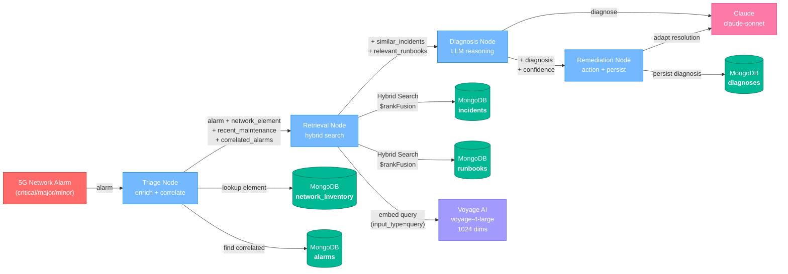

# NOC Copilot 🛰️

### Autonomous Network Incident Resolution Agent

**MongoDB x Voyage AI x Anthropic x LangGraph**

[](https://www.python.org/downloads/)
[](https://www.mongodb.com/atlas)

---

## Overview

NOC Copilot is an agentic AI system purpose-built for telecommunications Network Operations Centers (NOCs). When a 5G network alarm fires, the agent autonomously triages the alarm by enriching it with network element data and maintenance history, retrieves semantically similar past incidents and relevant runbook sections from a knowledge base, uses an LLM to diagnose the probable root cause with a calibrated confidence score, and proposes a concrete remediation action. If the confidence exceeds a threshold and the action matches a pre-approved pattern, the system can auto-remediate without human intervention; otherwise it escalates with a full evidence chain for the on-call engineer.

This architecture maps directly to the **TM Forum Autonomous Network** framework, which defines six levels of network autonomy from Level 0 (manual operations) through Level 5 (full autonomy). Today most telco NOCs operate at Level 1 (assisted operations), where engineers manually correlate alarms, search knowledge bases, and apply runbook procedures. NOC Copilot demonstrates what **Level 3 (conditional automation)** looks like in practice: the system handles the full detect-diagnose-remediate loop autonomously for high-confidence scenarios and escalates to a human for ambiguous or novel situations. The confidence-based escalation mechanism is the critical boundary between Level 3 and Level 4.

The system is built on **MongoDB as a single unified data platform**. Rather than stitching together separate databases for operational data, full-text search, and vector search, NOC Copilot stores all five collections (alarms, incidents, runbooks, network inventory, diagnoses) in MongoDB and leverages native `$rankFusion` hybrid search to combine Full Text Search for precise keyword lookups with Vector Search for semantic similarity -- all executing server-side in a single aggregation pipeline. **Voyage AI** generates high-quality embeddings via `voyage-4-large` (standard asymmetric embeddings) and `voyage-context-3` (contextualized chunk embeddings for runbooks), **Claude** provides the reasoning engine for diagnosis and remediation adaptation, and **LangGraph** orchestrates the four-node agent pipeline as a deterministic state machine.

---

## Architecture



**Data flow:** An incoming alarm enters the **Triage Node**, which looks up the source network element and checks for recent maintenance and correlated active alarms in MongoDB. The enriched context flows to the **Retrieval Node**, which generates a Voyage AI embedding of the alarm description and runs hybrid search (`$rankFusion`) against both historical incidents and runbook sections. The **Diagnosis Node** passes all gathered evidence to Claude, which returns a structured JSON diagnosis with confidence score, reasoning chain, supporting evidence, and differential diagnoses. Finally, the **Remediation Node** uses Claude to adapt the most similar past resolution to the current context, checks whether the action qualifies for auto-remediation (confidence > 0.9 and action matches a pre-approved pattern), persists the full diagnosis record back to MongoDB, and returns the recommendation.

---

## Key Features

- **Hybrid search with native `$rankFusion`** -- combines Voyage AI vector search (semantic similarity) and full-text search (compound queries, fuzzy matching, facet-based filtering) server-side in a single aggregation pipeline. Used for both incident matching and runbook retrieval — finds semantically similar results even when the vocabulary differs entirely (e.g., "packet loss" matched to "UL quality degradation") while also boosting results that contain exact technical terms
- **Multi-step agentic reasoning** -- LangGraph state machine with four deterministic nodes (triage, retrieval, diagnosis, remediation) and dependency-injected database and embedder resources
- **Maintenance correlation and alarm enrichment** -- checks for recent maintenance windows on the affected element and finds correlated active alarms at the same site or region
- **Confidence-based auto-remediation vs. human escalation** -- confidence >= 0.9 with a pre-approved action pattern triggers auto-remediation; 0.7-0.9 recommends action with human approval; below 0.7 escalates with a suggested investigation direction
- **Full evidence chain for auditability** -- every diagnosis record includes the alarm, network element context, maintenance history, similar incident IDs, reasoning chain, supporting evidence, and recommended action, all persisted to MongoDB

---

## Technology Deep Dive

### Why Voyage AI

NOC Copilot uses two Voyage AI models:

**`voyage-4-large`** -- for incidents, alarms, and search queries:

- **1024 dimensions** with cosine similarity (supports Matryoshka dimensions: 2048, 1024, 512, 256)
- **Mixture-of-Experts architecture** -- 14% improvement over OpenAI v3 Large at 40% lower serving cost
- **Asymmetric embedding** -- documents are embedded with `input_type="document"` at index time, while queries use `input_type="query"` at search time. The model optimizes the embedding space differently for short queries versus longer document passages

**`voyage-context-3`** -- for runbook sections using **contextualized chunk embeddings**:

- Runbook sections belonging to the same runbook are embedded together in a **single neural network pass** via the `contextualized_embed()` API
- Each section's embedding encodes both its **own content** (focused detail) and **global document context** (information from sibling sections in the same runbook)
- This solves a fundamental RAG trade-off: chunked documents lose global context, but contextualized embeddings preserve it without requiring overlapping chunks or LLM-generated summaries
- 14.24% better chunk-level retrieval than OpenAI v3 Large; 23.66% better than late-chunking approaches

**Why this matters for telco** -- alarms and incidents often describe the same underlying problem with completely different vocabulary. An alarm might say "excessive UL BLER on Cell-3 with RSRP degradation" while the matching past incident is titled "Uplink quality degradation due to antenna misconfiguration after RET adjustment." Semantic embeddings bridge this vocabulary gap where keyword search alone would fail. For runbooks, contextualized embeddings mean that a "Step 3: Resolution" section is embedded with awareness of "Step 1: Assessment" and "Step 2: Data Collection" from the same runbook, producing much better retrieval for procedural queries.

The `VoyageEmbedder` class wraps both APIs with batching, retry, and rate-limit buffering:

```python
class VoyageEmbedder:
    def embed_documents(self, texts: list[str]) -> list[list[float]]:
        """Embed documents with voyage-4-large (input_type='document')."""
        ...

    def embed_query(self, text: str) -> list[float]:
        """Embed a query with voyage-4-large (input_type='query')."""
        ...

    def embed_runbook_chunks(self, runbooks: list[dict]) -> list[list[float]]:
        """Embed runbook sections with voyage-context-3 (contextualized_embed).
        Sections from the same runbook are grouped and embedded together."""
        ...
```

### Full Text Search vs Vector Search vs Hybrid

NOC Copilot's hybrid search combines two underlying search strategies into a single pipeline:

| Strategy | When to Use | NOC Copilot Usage |
|----------|------------|-------------------|
| **Vector Search** | Semantically similar but lexically different content. "Packet loss" should match "UL quality degradation." | Semantic similarity component within hybrid search |
| **Full Text Search** | Exact terms, error codes, config parameters, element IDs. "RET angle" must appear in the runbook. | Keyword matching component within hybrid search |
| **Hybrid ($rankFusion)** | Need both precision *and* recall. Want results that are semantically relevant AND contain the exact technical terms. | Primary retrieval strategy for both incidents and runbooks in the agent pipeline |

#### Vector Search

Vector Search uses a `$vectorSearch` aggregation stage with pre-filtering on metadata fields:

```javascript
{
  "$vectorSearch": {
    "index": "incidents_vector_index",
    "path": "embedding",
    "queryVector": [0.023, -0.041, ...],  // 1024 dims from Voyage AI
    "numCandidates": 100,
    "limit": 5,
    "filter": {
      "category": { "$eq": "radio" }
    }
  }
}
```

The vector search indexes include filter fields (category, severity, status, domain) so pre-filtering happens at the ANN index level rather than as a post-filter, which is critical for performance with filtered queries.

#### Full-Text Search

Full Text Search uses compound queries with `must` and `filter` clauses, fuzzy matching (`maxEdits: 1`), and highlighting:

```javascript
{
  "$search": {
    "index": "runbooks_search_index",
    "compound": {
      "must": [{
        "text": {
          "query": "RET angle antenna tilt troubleshooting",
          "path": ["title", "content"],
          "fuzzy": { "maxEdits": 1 }
        }
      }],
      "filter": [{
        "text": { "query": "radio", "path": "domain" }
      }]
    },
    "highlight": { "path": ["content", "title"] }
  }
}
```

#### Hybrid Search: `$rankFusion` vs `$scoreFusion`

Both stages combine results from multiple sub-pipelines (a `$vectorSearch` pipeline and a `$search` pipeline) into a single ranked result set, entirely server-side in one aggregation pipeline.

**`$rankFusion` (MongoDB 8.2+)** uses Reciprocal Rank Fusion (RRF). It computes the final score from the *rank positions* of each document across sub-pipelines, not from the raw scores. This makes it robust to score-scale differences between vector search (scores in 0-1) and text search (unbounded Lucene scores). The formula is:

```
score = sum(weight_i / (rank_i + rankConstant))
```

**`$scoreFusion` (MongoDB 8.2+)** uses the *actual scores* from each sub-pipeline. Before combining, it normalizes scores using a configurable strategy:
- `"sigmoid"` -- applies a sigmoid function to raw scores (good default)
- `"minMaxScaler"` -- scales scores to [0, 1] within each pipeline
- `"none"` -- no normalization; use raw scores as-is

Because `$scoreFusion` operates on actual score values, it can be more precise when you understand the score distributions, but it is also more sensitive to score-scale mismatches when normalization is disabled.

Both stages support per-pipeline weights and `scoreDetails` for transparency:

```javascript
// $rankFusion example
{
  "$rankFusion": {
    "input": {
      "pipelines": {
        "vector_search": [{ "$vectorSearch": { ... } }],
        "text_search": [{ "$search": { ... } }, { "$limit": 10 }]
      }
    },
    "combination": {
      "weights": { "vector_search": 0.6, "text_search": 0.4 }
    },
    "scoreDetails": true
  }
}
```

**scoreDetails output** -- when `scoreDetails: true` is set, each result includes a breakdown showing the contribution from each sub-pipeline:

```json
{
  "scoreDetails": {
    "value": 0.0234,
    "description": "rank fusion score",
    "details": [
      {
        "inputPipeline": "vector_search",
        "rank": 1,
        "weight": 0.6,
        "score": 0.0099
      },
      {
        "inputPipeline": "text_search",
        "rank": 3,
        "weight": 0.4,
        "score": 0.0135
      }
    ]
  }
}
```

For `$scoreFusion` with sigmoid normalization, the scoreDetails show the normalized scores:

```json
{
  "scoreDetails": {
    "value": 0.7621,
    "description": "score fusion (sigmoid normalization)",
    "details": [
      {
        "inputPipeline": "vector_search",
        "rawScore": 0.9134,
        "normalizedScore": 0.7137,
        "weight": 0.6,
        "weightedScore": 0.4282
      },
      {
        "inputPipeline": "text_search",
        "rawScore": 4.2871,
        "normalizedScore": 0.8348,
        "weight": 0.4,
        "weightedScore": 0.3339
      }
    ]
  }
}
```

### LangGraph Agent Architecture

The agent is built as a **LangGraph StateGraph** with a linear four-node pipeline:

```
triage --> retrieval --> diagnosis --> remediation --> END
```

Key design decisions:

1. **State machine approach** -- the `NOCAgentState` TypedDict defines the complete state schema (alarm, enrichment data, retrieval results, diagnosis, remediation outcome). Each node receives the full state and returns its updates, which LangGraph merges.

2. **Deterministic linear pipeline** -- unlike a ReAct agent that decides which tool to call next, this pipeline always executes all four nodes in sequence. This is intentional: for a NOC incident, you always need enrichment, always need retrieval, always need diagnosis, and always need a remediation recommendation. The deterministic flow makes the system predictable and auditable.

3. **Dependency injection** -- the database connection and embedder are injected into nodes via `functools.partial` at graph build time, keeping the nodes testable and the graph definition clean:

```python
def build_noc_agent(db: AsyncIOMotorDatabase, embedder: VoyageEmbedder):
    graph = StateGraph(NOCAgentState)
    graph.add_node("triage", partial(triage_node, db=db))
    graph.add_node("retrieval", partial(retrieval_node, db=db, embedder=embedder))
    graph.add_node("diagnosis", diagnosis_node)
    graph.add_node("remediation", partial(remediation_node, db=db))
    graph.set_entry_point("triage")
    graph.add_edge("triage", "retrieval")
    graph.add_edge("retrieval", "diagnosis")
    graph.add_edge("diagnosis", "remediation")
    graph.add_edge("remediation", END)
    return graph.compile()
```

---

## Data Model

### `alarms` Collection

Active network alarms ingested from the 5G RAN, transport, and core domains.

```json
{
  "alarm_id": "ALM-20240115-0042",
  "timestamp": "2024-01-15T14:23:00Z",
  "source": "gNB-SITE-A12-001",
  "severity": "critical",
  "category": "radio",
  "description": "Excessive UL BLER on Cell-3 sector of gNB-SITE-A12-001, RSRP degradation detected. UL BLER exceeding 15% threshold with concurrent RSRP drop of 8dB over 2-hour window.",
  "metrics": {
    "ul_bler": 0.18,
    "rsrp_delta_db": -8.2,
    "affected_ues": 147
  },
  "region": "us-west-2",
  "network_slice": "eMBB",
  "status": "active",
  "embedding": [0.023, -0.041, ...]
}
```

**Embedding strategy:** Composed from `"{severity} {category} {description}"`, embedded with `voyage-4-large` (`input_type="document"`).

### `incidents` Collection

Historical incident records including root cause analysis and resolution steps.

```json
{
  "incident_id": "INC-2024-0891",
  "title": "Uplink Quality Degradation Due to Antenna Misconfiguration After RET Adjustment",
  "description": "Multiple cells at Site A12 experienced UL quality degradation following scheduled RET antenna tilt adjustment...",
  "root_cause": "RET antenna electrical tilt was over-adjusted by 3 degrees beyond the planned value, causing uplink coverage hole and increased UL BLER for edge-of-cell UEs.",
  "resolution": "Reverted RET angle from 8 degrees to the planned 5 degrees. UL BLER returned to normal within 15 minutes.",
  "affected_elements": ["gNB-SITE-A12-001", "gNB-SITE-A12-002"],
  "category": "radio",
  "severity": "critical",
  "ttd_minutes": 45,
  "ttr_minutes": 30,
  "created_at": "2024-01-10T09:15:00Z",
  "resolved_at": "2024-01-10T10:30:00Z",
  "tags": ["5G NR", "RET", "antenna", "UL BLER"],
  "embedding": [0.018, -0.037, ...]
}
```

**Embedding strategy:** Composed from `"{title} {root_cause} {resolution}"`, embedded with `voyage-4-large` (`input_type="document"`).

### `runbooks` Collection

Runbook sections broken into granular, searchable units.

```json
{
  "runbook_id": "RB-RADIO-001",
  "title": "5G NR Radio Performance Troubleshooting",
  "section_title": "RET Antenna Tilt Verification and Rollback",
  "section_number": 4,
  "content": "When UL BLER exceeds threshold after a RET adjustment: 1) Verify current electrical tilt via OSS. 2) Compare with planned tilt from RF planning tool. 3) If delta exceeds 2 degrees, initiate rollback. 4) Monitor UL BLER for 15 minutes post-rollback. 5) Escalate to RF planning team if issue persists.",
  "applicable_to": ["5G NR", "LTE"],
  "domain": "radio",
  "last_updated": "2024-01-05T00:00:00Z",
  "embedding": [-0.012, 0.054, ...]
}
```

**Embedding strategy:** Sections from the same runbook are grouped and embedded together using `voyage-context-3` via `contextualized_embed()`. Each section's text is composed as `"{title} {section_title} {content}"`. The contextualized embedding encodes both the section's own content and the surrounding context from sibling sections in the same runbook.

### `network_inventory` Collection

Network element inventory with configuration and maintenance history.

```json
{
  "element_id": "gNB-SITE-A12-001",
  "type": "gNodeB",
  "vendor": "Ericsson",
  "model": "AIR 6449",
  "site_id": "SITE-A12",
  "site_name": "Downtown Tower Alpha-12",
  "region": "us-west-2",
  "sectors": 3,
  "config": {
    "frequency_band": "n78",
    "bandwidth_mhz": 100,
    "max_tx_power_dbm": 49
  },
  "maintenance_log": [
    {
      "date": "2024-01-14T10:00:00Z",
      "action": "RET antenna tilt adjustment on Sector 3 (2 deg to 8 deg)",
      "engineer": "J. Smith",
      "ticket": "CHG-2024-0456"
    }
  ],
  "status": "active"
}
```

**Embedding strategy:** Network elements are not embedded. They are looked up by `element_id` using standard MongoDB queries.

### `diagnoses` Collection

Agent diagnosis records, persisted for auditability and continuous improvement.

```json
{
  "alarm_id": "ALM-20240115-0042",
  "alarm": { "...full alarm document..." },
  "network_element_id": "gNB-SITE-A12-001",
  "diagnosis": {
    "probable_root_cause": "RET antenna electrical tilt was over-adjusted during maintenance on 2024-01-14, causing UL coverage degradation on Sector 3.",
    "confidence": 0.92,
    "reasoning": "The alarm describes UL BLER exceeding threshold with RSRP degradation. The network element had a RET adjustment 24 hours prior. A highly similar past incident (score 0.943) had the same root cause and was resolved by reverting the RET angle.",
    "supporting_evidence": [
      "Recent maintenance: RET tilt adjustment from 2 to 8 degrees on Sector 3",
      "Similar incident INC-2024-0891 (score 0.943): same root cause, resolved by RET revert",
      "Runbook RB-RADIO-001 Section 4: RET rollback procedure when delta exceeds 2 degrees"
    ],
    "differential_diagnoses": [
      {
        "cause": "Hardware failure on Sector 3 antenna module",
        "confidence": 0.06,
        "why_less_likely": "RSRP degradation pattern is gradual, not sudden, and correlates with the tilt change timeline"
      }
    ]
  },
  "confidence": 0.92,
  "recommended_action": "AUTO-REMEDIATION: revert RET angle on gNB-SITE-A12-001 Sector 3 from 8 degrees to the planned 5 degrees",
  "auto_remediable": true,
  "evidence_chain": [
    "Alarm received: [critical] Excessive UL BLER on Cell-3 sector of gNB-SITE-A12-001...",
    "Source element identified: gNodeB Ericsson AIR 6449 at Downtown Tower Alpha-12",
    "Recent maintenance found: RET antenna tilt adjustment on Sector 3 (2 deg to 8 deg)",
    "Most similar past incident (score 0.943): Uplink Quality Degradation Due to Antenna Misconfiguration...",
    "Diagnosis: RET antenna electrical tilt was over-adjusted...",
    "Confidence: 0.92"
  ],
  "similar_incident_ids": ["INC-2024-0891", "INC-2024-0734", "INC-2024-0612"],
  "created_at": "2024-01-15T14:24:12Z"
}
```

---

## Prerequisites

| Requirement | Details |
|------------|---------|
| **Python** | 3.11 or later (managed via [uv](https://docs.astral.sh/uv/)) |
| **MongoDB Atlas cluster** | MongoDB **8.2+** (see [Atlas Cluster Requirements](#atlas-cluster-requirements)) |
| **Voyage AI API key** | Sign up at [dash.voyageai.com](https://dash.voyageai.com). Free tier provides 200M tokens/month. |
| **Anthropic API key** | Sign up at [console.anthropic.com](https://console.anthropic.com). |

---

## Quick Start

```bash
# 1. Clone the repository
git clone https://github.com/your-org/noc-copilot.git
cd noc-copilot

# 2. Install dependencies with uv
uv sync

# 3. Configure environment variables
cp .env.example .env
# Edit .env with your credentials:
#   MONGODB_URI=mongodb+srv://<user>:<password>@<cluster>.mongodb.net/
#   MONGODB_DATABASE=noc_copilot
#   VOYAGE_API_KEY=your-voyage-ai-api-key
#   ANTHROPIC_API_KEY=your-anthropic-api-key

# 4. Load seed data with Voyage AI embeddings
# This generates embeddings for 28 incidents, 22 runbook sections, and 6 demo alarms
# using Voyage AI, then inserts everything into MongoDB.
# Seed data is defined in src/noc_copilot/data/seed_data.py (18 network elements,
# 28 incidents, 22 runbook sections, 6 demo alarms — all with realistic telco content).
uv run python scripts/load_data.py

# 5. Create Full Text Search and Vector Search indexes (waits until READY)
uv run python scripts/setup_atlas.py

# 6. Run the demo (terminal UI)
uv run python scripts/run_demo.py

# Or with TM Forum Autonomous Network L3→L4 level mapping after each alarm
uv run python scripts/run_demo.py --explain-levels

# Or launch the Streamlit dashboard (level mapping available as an expander)
uv run streamlit run src/noc_copilot/ui/streamlit_app.py
```

---

## Demo Walkthrough

The terminal demo walks through a realistic telco incident scenario end to end. Add `--explain-levels` to see the TM Forum Autonomous Network level mapping after each alarm.

### 1. Alarm Dashboard

When you run `uv run python scripts/run_demo.py`, the system connects to MongoDB Atlas, verifies that data and search indexes are loaded, and presents an **Active Alarm Dashboard** showing all active alarms sorted by severity (critical first). Each alarm displays its ID, severity level (with color coding), category, source element, region, and description.

```
╔═══╦══════════════╦══════════╦═══════════╦═════════╦═════════════╗
║ # ║ Alarm ID     ║ Severity ║ Category  ║ Source  ║ Description ║
╠═══╬══════════════╬══════════╬═══════════╬═════════╬═════════════╣
║ 1 ║ ALM-...-0042 ║ CRITICAL ║ radio     ║ gNB-... ║ Excessive   ║
║ 2 ║ ALM-...-0043 ║ MAJOR    ║ transport ║ MW-...  ║ Microwave   ║
║ 3 ║ ALM-...-0044 ║ MINOR    ║ core      ║ UPF-... ║ Session     ║
╚═══╩══════════════╩══════════╩═══════════╩═════════╩═════════════╝

Select an alarm to process (enter number), or 'all' to process all, or 'q' to quit:
> 1
```

### 2. Step 1: Triage & Enrichment

The triage node looks up the source network element in `network_inventory`, displays its type, vendor, model, site, and status. It checks for **recent maintenance** (last 7 days) on the element, which is often the smoking gun for post-change incidents. It also finds **correlated active alarms** at the same site or region that might indicate a wider issue.

```
STEP 1: TRIAGE & ENRICHMENT
Network Element: gNodeB | Ericsson AIR 6449 | Downtown Tower Alpha-12 | us-west-2

  Recent Maintenance (1 entry):
    - 2024-01-14: RET antenna tilt adjustment on Sector 3 (2 deg to 8 deg) (by J. Smith)

  Correlated Active Alarms (0):
    No correlated alarms found.
```

### 3. Step 2: Knowledge Retrieval

The retrieval node generates a Voyage AI embedding of the alarm description enriched with element context and maintenance history, then executes two searches:

- **Hybrid Search** (`$rankFusion`) against `incidents` returns the top 5 similar past incidents, combining vector similarity and full-text keyword relevance
- **Hybrid Search** (`$rankFusion`) against `runbooks` returns the top 5 relevant runbook sections, combining vector similarity and full-text keyword relevance

```
STEP 2: KNOWLEDGE RETRIEVAL

Similar Past Incidents (Hybrid Search — $rankFusion):
  0.0234  INC-2024-0891  Uplink Quality Degradation Due to Antenna Misc...
  0.0198  INC-2024-0734  Cell Edge Coverage Hole After RET Parameter Ch...
  0.0156  INC-2024-0612  Sector Outage Following Antenna Maintenance...

Relevant Runbook Sections (Hybrid Search — $rankFusion):
  0.0234  RB-RADIO-001   5G NR Radio Performance Troubleshooting — RET Antenna Tilt Verification
  0.0198  RB-RADIO-001   5G NR Radio Performance Troubleshooting — UL BLER Diagnostics
  0.0156  RB-RADIO-003   Antenna System Maintenance — Post-Change Verification
```

### 4. Step 3: AI Diagnosis

The diagnosis node passes the alarm, network element, maintenance history, correlated alarms, similar incidents, and runbook sections to Claude, which returns a structured diagnosis:

```
STEP 3: AI DIAGNOSIS

Confidence: ██████████████████████████████░░ 92%

Probable Root Cause:
  RET antenna electrical tilt was over-adjusted during maintenance on 2024-01-14,
  causing UL coverage degradation on Sector 3.

Reasoning Chain:
  The alarm describes UL BLER exceeding threshold with RSRP degradation. The network
  element had a RET adjustment 24 hours prior (from 2 to 8 degrees — a 6 degree delta
  far exceeding the planned 3 degree change). A highly similar past incident
  (score 0.943) had the exact same root cause and was resolved by reverting the RET angle.

Supporting Evidence:
  - Recent maintenance: RET tilt adjustment from 2 to 8 degrees on Sector 3
  - Similar incident INC-2024-0891 (score 0.943): same root cause
  - Runbook RB-RADIO-001 Section 4: RET rollback procedure

Differential Diagnoses:
  - Hardware failure (6%) — gradual pattern rules out sudden failure
  - Interference from adjacent cell (2%) — no correlated alarms on neighbors
```

### 5. Step 4: Remediation

With confidence at 0.92 (above the 0.9 threshold) and the recommended action matching the pre-approved "revert RET angle" pattern, the system produces an **auto-remediation** decision:

```
STEP 4: REMEDIATION

  [Auto-Remediation Approved]
  AUTO-REMEDIATION: revert RET angle on gNB-SITE-A12-001
  Sector 3 from 8 degrees to the planned 5 degrees

  Evidence Chain:
    1. Alarm received: [critical] Excessive UL BLER on Cell-3 sector...
    2. Source element identified: gNodeB Ericsson AIR 6449
    3. Recent maintenance found: RET antenna tilt adjustment on Sector 3
    4. Most similar past incident (score 0.943): Uplink Quality Degradation...
    5. Diagnosis: RET antenna electrical tilt was over-adjusted...
    6. Confidence: 0.92

  [Performance Comparison]
  NOC Copilot:         8.3s total
  Manual NOC process:  ~75 min (45 min TTD + 30 min TTR)
  Speed improvement:   ~542x faster
```

The full diagnosis record is persisted to the `diagnoses` collection in MongoDB for auditability.

### 6. TM Forum Autonomous Network Level Mapping

Run with `--explain-levels` (or expand the "TM Forum Autonomous Network Levels" section in Streamlit) to see a dynamic mapping of the pipeline results to the TM Forum Autonomous Network evaluation framework.

The system maps each pipeline run to the **P/S cognitive dimension matrix** (People vs System), showing where the current pipeline sits at **Level 3 (Conditional Automation)** and what concrete changes would move it to **Level 4 (High Automation)**:

| Dimension | L3 — Current Pipeline | L4 — Agentic Upgrade |
|-----------|----------------------|---------------------|
| **Execution** | **S** — Pipeline ran end-to-end | **S** — No change |
| **Awareness** | **S** — Element lookup, maintenance, correlated alarms | **S** — Agent chooses what to investigate (tool use) |
| **Analysis** | **P/S** — LLM diagnoses, human reviews | **S** — Agent retries retrieval on low confidence |
| **Decision** | **P/S** — Confidence threshold gates human approval | **S** — AI reasons about whether to act |
| **Intent** | **P** — User selects alarm manually | **P/S** — System prioritises alarms proactively |

The output is dynamic — it references the actual confidence score, number of correlated alarms, top retrieval score, and remediation outcome from the alarm that was just processed. It then shows five concrete upgrades to reach Level 4: tool-calling triage, retrieval retry loops, diagnosis-driven re-investigation, closed-loop remediation with verification, and cross-domain correlation.

---

## Search Examples

### Hybrid Search: Finding Similar Incidents

**Query:** `"excessive packet loss on 5G NR cell sector, UL BLER exceeding threshold"`

This query uses colloquial/operational language. Hybrid search combines vector similarity with full-text keyword matching to find incidents that describe the same underlying problem even when the titles and descriptions use different terminology:

| Score  | Incident ID    | Title                                                    |
|--------|---------------|----------------------------------------------------------|
| 0.0234 | INC-2024-0891 | Uplink Quality Degradation Due to Antenna Misconfiguration |
| 0.0198 | INC-2024-0734 | Cell Edge Coverage Hole After RET Parameter Change        |
| 0.0156 | INC-2024-0612 | Sector Outage Following Antenna Maintenance               |

Note that none of the top results contain the exact phrase "packet loss" -- they use "quality degradation", "coverage hole", and "sector outage" instead. The vector component bridges this vocabulary gap while the full-text component boosts results that contain exact technical terms from the query.

### Full Text Search: Finding Runbooks by Exact Terms

**Query:** `"RET angle antenna tilt troubleshooting"` with domain filter `"radio"`

Full-text search retrieves runbook sections that contain the exact technical terms:

| Score  | Runbook ID   | Section                                     |
|--------|-------------|---------------------------------------------|
| 8.4521 | RB-RADIO-001| RET Antenna Tilt Verification and Rollback  |
| 6.2134 | RB-RADIO-001| UL BLER Diagnostic Procedures               |
| 4.1872 | RB-RADIO-003| Post-Change Verification Checklist           |

### Hybrid Search: `$rankFusion` with scoreDetails

**Query:** `"UL BLER high block error rate troubleshooting 5G NR"`

The `$rankFusion` stage combines vector and text search results. The scoreDetails break down each document's contribution:

```json
{
  "title": "5G NR Radio Performance Troubleshooting",
  "section_title": "UL BLER Diagnostic Procedures",
  "score": 0.0234,
  "scoreDetails": {
    "value": 0.0234,
    "description": "rank fusion score",
    "details": [
      {
        "inputPipeline": "vector_search",
        "rank": 1,
        "weight": 0.6,
        "score": 0.0099
      },
      {
        "inputPipeline": "text_search",
        "rank": 3,
        "weight": 0.4,
        "score": 0.0135
      }
    ]
  }
}
```

This document ranked #1 in vector search (semantically relevant) and #3 in text search (contains "UL BLER" and "troubleshooting" but not "block error rate" verbatim). RRF combines both signals.

### Hybrid Search: `$scoreFusion` with Sigmoid Normalization

The same query using `$scoreFusion` with sigmoid normalization produces actual normalized scores instead of rank-based scores:

```json
{
  "title": "5G NR Radio Performance Troubleshooting",
  "section_title": "UL BLER Diagnostic Procedures",
  "score": 0.7621,
  "scoreDetails": {
    "value": 0.7621,
    "description": "score fusion (sigmoid normalization)",
    "details": [
      {
        "inputPipeline": "vector_search",
        "rawScore": 0.9134,
        "normalizedScore": 0.7137,
        "weight": 0.6,
        "weightedScore": 0.4282
      },
      {
        "inputPipeline": "text_search",
        "rawScore": 4.2871,
        "normalizedScore": 0.8348,
        "weight": 0.4,
        "weightedScore": 0.3339
      }
    ]
  }
}
```

The sigmoid function maps the vector score (0.9134, already in [0,1]) and the Lucene text score (4.2871, unbounded) to a comparable scale before applying weights.

### Running the Search Test Suite

You can run all search types independently without the full agent pipeline:

```bash
uv run python scripts/test_search.py
```

This executes five tests in sequence: standalone vector search on incidents, standalone full-text search on runbooks, hybrid `$rankFusion` on runbooks, hybrid `$scoreFusion` on runbooks, and hybrid `$rankFusion` on incidents, displaying results in formatted tables.

---

## Teardown / Cleanup

To reset or remove the demo data and indexes:

```bash
# Option 1: Re-run load_data.py — it clears and reloads all documents
# (idempotent — safe to run multiple times, preserves search indexes)
uv run python scripts/load_data.py

# Option 2: Drop the entire database via mongosh or Python
uv run python -c "
from noc_copilot.config import get_settings
from noc_copilot.db.connection import MongoDBConnection
db = MongoDBConnection.get_sync_db()
db.client.drop_database(get_settings().mongodb_database)
print('Database dropped.')
MongoDBConnection.close()
"
```

> **Note:** Dropping the database also removes all Full Text Search and Vector Search indexes.
> You will need to re-run `uv run python scripts/load_data.py` and `uv run python scripts/setup_atlas.py` to set up again.

To delete the Atlas cluster entirely, go to the Atlas UI > your cluster > **...** > **Terminate**.

---

## Extending the Demo

The current demo is a self-contained showcase. Here are ideas for extending it into a production-grade system:

- **Change Streams** -- use MongoDB Change Streams to watch the `alarms` collection for new documents and automatically trigger the agent pipeline in real time, turning the demo into a live event-driven system
- **MCP Server** -- expose the NOC Copilot agent as a Model Context Protocol (MCP) server, allowing Claude Desktop or other MCP-compatible clients to invoke incident resolution as a tool
- **Evaluation framework** -- build a ground-truth dataset of alarm-to-diagnosis pairs and measure retrieval precision/recall, diagnosis accuracy, and confidence calibration across different embedding models and search strategies
- **Network simulators** -- integrate with open-source 5G simulators (e.g., UERANSIM, Open5GS) to generate realistic alarm streams and test the system under load
- **Multi-alarm correlation** -- extend the triage node to detect patterns across multiple simultaneous alarms (e.g., cascading failures from a transport link outage affecting multiple gNodeBs)
- **Intent-based networking** -- connect the remediation node to a network controller API to actually execute auto-remediation actions (e.g., adjusting RET parameters via NETCONF) rather than just recommending them
- **Feedback loop** -- let NOC engineers rate diagnosis accuracy and use the feedback to fine-tune embeddings or adjust confidence thresholds over time

---

## Atlas Cluster Requirements

This demo assumes you already have a MongoDB Atlas cluster provisioned. The cluster must meet these requirements:

- **MongoDB 8.2+** — required for the native `$rankFusion` hybrid search operator used in the agent pipeline (`$scoreFusion` is also available in the search explorer).
- A database user with read/write access and your IP in the network access list.

Your connection string goes in `.env` as `MONGODB_URI`. The `setup_atlas.py` script handles creating all 5 search indexes and polls until they're ready.

---

## Project Structure

```
noc-copilot/
├── pyproject.toml                          # Package metadata and dependencies
├── .env.example                            # Environment variable template
├── .gitignore                              # Git ignore rules
├── README.md                               # This file
│
├── scripts/
│   ├── setup_atlas.py                      # Create Full Text Search + Vector Search indexes
│   ├── load_data.py                        # Generate embeddings and seed the database
│   ├── run_demo.py                         # Launch the terminal demo
│   └── test_search.py                      # Run individual search type tests
│
├── src/
│   └── noc_copilot/
│       ├── __init__.py
│       ├── config.py                       # Settings loaded from .env (Pydantic)
│       ├── models.py                       # Pydantic models: Alarm, Incident, Runbook, etc.
│       │
│       ├── agent/
│       │   ├── __init__.py
│       │   ├── graph.py                    # LangGraph StateGraph definition
│       │   ├── state.py                    # NOCAgentState TypedDict
│       │   ├── tools.py                    # Reserved for future tool definitions
│       │   └── nodes/
│       │       ├── __init__.py
│       │       ├── triage.py               # Triage node: element lookup, maintenance, correlation
│       │       ├── retrieval.py            # Retrieval node: hybrid search for incidents + runbooks
│       │       ├── diagnosis.py            # Diagnosis node: Claude LLM reasoning
│       │       └── remediation.py          # Remediation node: action, persist, escalation
│       │
│       ├── db/
│       │   ├── __init__.py
│       │   ├── collections.py              # Collection name constants
│       │   ├── connection.py               # Sync + async MongoDB connection manager
│       │   └── indexes.py                  # Full Text Search / Vector Search index definitions
│       │
│       ├── embeddings/
│       │   ├── __init__.py
│       │   └── voyage.py                   # VoyageEmbedder: batch embed + query embed
│       │
│       ├── search/
│       │   ├── __init__.py
│       │   ├── vector_search.py            # $vectorSearch queries (standalone vector search)
│       │   ├── full_text_search.py         # $search queries (standalone full-text search)
│       │   └── hybrid_search.py            # $rankFusion hybrid search (agent) + $scoreFusion (explorer)
│       │
│       ├── data/
│       │   ├── __init__.py
│       │   ├── generator.py                # Embedding generation for seed data
│       │   └── loader.py                   # Database seeding with embeddings
│       │
│       └── ui/
│           ├── __init__.py
│           ├── terminal.py                 # Rich-based terminal demo UI
│           └── streamlit_app.py            # Streamlit web dashboard
│
└── tests/
    ├── test_agent.py                       # Agent pipeline tests
    ├── test_embeddings.py                  # Embedding generation tests
    └── test_search.py                      # Search function tests
```

