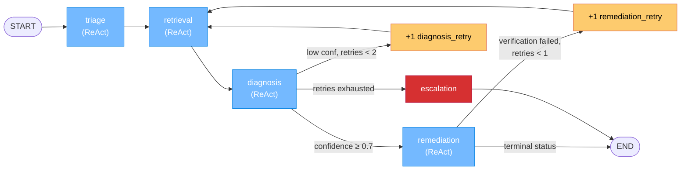

# NOC Copilot 🛰️

### Autonomous Network Incident Resolution Agent

**MongoDB x Voyage AI x Anthropic x LangGraph**

[](https://www.python.org/downloads/)
[](https://www.mongodb.com/atlas)

---

## Overview

NOC Copilot is an **agentic workflow** for telco Network Operations Centers — a LangGraph supervisor with a fixed phase order (triage → retrieval → diagnosis → remediation), where **each phase node is itself a [ReAct](https://arxiv.org/abs/2210.03629) sub-agent** with its own tool belt. When a 5G alarm fires, the LLM picks tools per alarm shape (a link-down alarm calls topology tools, a power alarm calls correlated-alarm tools), evaluates its own retrieval results and re-searches if they're poor, commits to a diagnosis with calibrated confidence, runs preconditions before any action, and verifies the alarm cleared. If confidence is too low or verification fails, conditional edges loop control back to retrieval for re-investigation, bounded by retry counters so the workflow never spins forever.

**Be explicit about what this is and isn't.** The phase *order* is hardcoded in the graph — the LLM cannot decide to skip retrieval or jump straight to remediation. The conditional edges between phases are deterministic Python functions reading state, not LLM calls. **What is genuinely LLM-driven** is *within* each phase: the LLM picks which tools to call and in what order, evaluates the results, decides whether to keep going or stop, and (in diagnosis and remediation) chooses among terminal actions including loop-back-for-more-evidence and escalate-to-human. This is the supervisor-of-ReAct-workers pattern — not a fully autonomous agent, but a real agentic workflow with substantive within-phase agency. See [Anthropic's "Building effective agents"](https://www.anthropic.com/research/building-effective-agents) for the workflow-vs-agent distinction this borrows from.

The system is built on **MongoDB as the unified data and agent-memory plane**. All operational collections (alarms, incidents, runbooks, network_inventory, diagnoses) plus `remediation_actions` live in MongoDB. Hybrid retrieval runs server-side in a single `$rankFusion` aggregation combining Voyage AI vector search and full-text search. Every diagnosis and every remediation action the agent takes is persisted alongside the rest of the operational data — that's the audit trail and the seed for fine-tuning the next iteration.

**Voyage AI** generates embeddings via `voyage-4-large` (asymmetric query/document) and `voyage-context-3` (contextualized chunk embeddings for runbooks). **Claude** drives reasoning at every phase. **LangGraph** orchestrates the supervisor graph and provides `create_react_agent` for the per-phase ReAct sub-loops.

**Reproducibility for live demos.** `temperature=0` plus engineered alarm fixtures keeps runs stable across re-executions. There's no replay layer — the agent always calls Claude live — so any demo run does talk to the API.

---

## Architecture



**Where the agency lives:**

- **Within a phase (LLM-driven)** — each phase node is a ReAct sub-agent built with `langgraph.prebuilt.create_react_agent` and a phase-specific tool belt. The LLM picks which tools to call (a link-down alarm calls topology tools, a power alarm calls correlated-alarm tools), evaluates each result, and stops when it has enough context. Within retrieval, the LLM also evaluates its own search-quality and decides whether to reformulate.
- **Across phases (code-driven)** — phase order is hardcoded. `route_after_diagnosis` and `route_after_remediation` are deterministic Python functions: they read state and decide where control goes next. Loop-backs are triggered by the LLM emitting a specific tool call (`request_more_evidence`, or a `verify_alarm_cleared` that returns failure), but the routing itself is code. Bounded by `MAX_DIAGNOSIS_RETRIES=2` and `MAX_REMEDIATION_RETRIES=1`; the router escalates when budgets are exhausted.

**The phases:**

| Phase | Tools the LLM picks from | Terminal action |
| ----- | ------------------------ | --------------- |
| **triage** | `lookup_network_element`, `check_recent_maintenance`, `find_correlated_alarms`, `check_topology_neighbors`, `query_kpi_history`, `check_recent_config_changes` | LLM stops when it has a coherent operational picture |
| **retrieval** | `search_similar_incidents` (hybrid `$rankFusion`), `search_runbooks` (hybrid `$rankFusion`), `evaluate_retrieval_quality` (search → evaluate → refine loop) | LLM stops when verdict is "good" or attempts ≥ 2 |
| **diagnosis** | `propose_diagnosis` (commit), `request_more_evidence` (loop back to retrieval) | One terminal tool call |
| **remediation** | `estimate_blast_radius`, `check_maintenance_window`, `verify_backup_exists`, `execute_remediation_step`, `verify_alarm_cleared`, `recommend_for_approval`, `escalate` | One of: auto_remediated / human_approval_required / escalated |

All MongoDB queries (operational data + hybrid search) and the final diagnosis + remediation_action records flow through one platform. Voyage AI provides embeddings; Claude drives reasoning. See [WALKTHROUGH.md](WALKTHROUGH.md) for the agentic anatomy in depth.

---

## Key Features

- **Per-phase ReAct loops** — within each phase the LLM picks tools from a phase-specific belt, sees results, and decides what to call next, until it stops. Implemented with `langgraph.prebuilt.create_react_agent`.
- **Search → evaluate → refine retrieval** — the LLM runs hybrid `$rankFusion` search, judges its own result quality with `evaluate_retrieval_quality`, and reformulates the query if scores are weak; bounded by retry counters.
- **Closed-loop remediation** — preconditions (blast radius, maintenance window, backup) → execute → verify; failed verification loops back through retrieval for re-investigation.
- **Hybrid search with native `$rankFusion`** — Voyage AI vector + full-text search combined server-side in one aggregation pipeline. Used as the workflow's core retrieval primitive.
- **MongoDB as agent memory** — diagnoses and remediation_actions persist to MongoDB alongside operational data; every workflow decision is auditable and serves as fine-tuning material for the next iteration.
- **Legible decisions** — every tool call, retry, and routing decision is captured in state and rendered by both the rich terminal UI (with a static graph tree, per-phase tool tables, and loop-back markers) and the Streamlit dashboard (with a live Mermaid graph render).

---

## Technology Deep Dive

### Why Voyage AI

NOC Copilot uses two Voyage AI models:

**`voyage-4-large`** -- for incidents, alarms, and search queries:

- **1024 dimensions** with cosine similarity (supports Matryoshka dimensions: 2048, 1024, 512, 256)
- **Mixture-of-Experts architecture** -- 14% improvement over OpenAI v3 Large at 40% lower serving cost
- **Asymmetric embedding** -- documents are embedded with `input_type="document"` at index time, while queries use `input_type="query"` at search time. The model optimizes the embedding space differently for short queries versus longer document passages

**`voyage-context-3`** -- for runbook sections using **contextualized chunk embeddings**:

- Runbook sections belonging to the same runbook are embedded together in a **single neural network pass** via the `contextualized_embed()` API
- Each section's embedding encodes both its **own content** (focused detail) and **global document context** (information from sibling sections in the same runbook)
- This solves a fundamental RAG trade-off: chunked documents lose global context, but contextualized embeddings preserve it without requiring overlapping chunks or LLM-generated summaries
- 14.24% better chunk-level retrieval than OpenAI v3 Large; 23.66% better than late-chunking approaches

**Why this matters for telco** -- alarms and incidents often describe the same underlying problem with completely different vocabulary. An alarm might say "excessive UL BLER on Cell-3 with RSRP degradation" while the matching past incident is titled "Uplink quality degradation due to antenna misconfiguration after RET adjustment." Semantic embeddings bridge this vocabulary gap where keyword search alone would fail. For runbooks, contextualized embeddings mean that a "Step 3: Resolution" section is embedded with awareness of "Step 1: Assessment" and "Step 2: Data Collection" from the same runbook, producing much better retrieval for procedural queries.

The `VoyageEmbedder` class wraps both APIs with batching, retry, and rate-limit buffering:

```python
class VoyageEmbedder:
    def embed_documents(self, texts: list[str]) -> list[list[float]]:
        """Embed documents with voyage-4-large (input_type='document')."""
        ...

    def embed_query(self, text: str) -> list[float]:
        """Embed a query with voyage-4-large (input_type='query')."""
        ...

    def embed_runbook_chunks(self, runbooks: list[dict]) -> list[list[float]]:
        """Embed runbook sections with voyage-context-3 (contextualized_embed).
        Sections from the same runbook are grouped and embedded together."""
        ...
```

### Full Text Search vs Vector Search vs Hybrid

NOC Copilot's hybrid search combines two underlying search strategies into a single pipeline:

| Strategy | When to Use | NOC Copilot Usage |
|----------|------------|-------------------|
| **Vector Search** | Semantically similar but lexically different content. "Packet loss" should match "UL quality degradation." | Semantic similarity component within hybrid search |
| **Full Text Search** | Exact terms, error codes, config parameters, element IDs. "RET angle" must appear in the runbook. | Keyword matching component within hybrid search |
| **Hybrid ($rankFusion)** | Need both precision *and* recall. Want results that are semantically relevant AND contain the exact technical terms. | Primary retrieval strategy for both incidents and runbooks in the agent pipeline |

#### Vector Search

Vector Search uses a `$vectorSearch` aggregation stage with pre-filtering on metadata fields:

```javascript
{
  "$vectorSearch": {
    "index": "incidents_vector_index",
    "path": "embedding",
    "queryVector": [0.023, -0.041, ...],  // 1024 dims from Voyage AI
    "numCandidates": 100,
    "limit": 5,
    "filter": {
      "category": { "$eq": "radio" }
    }
  }
}
```

The vector search indexes include filter fields (category, severity, status, domain) so pre-filtering happens at the ANN index level rather than as a post-filter, which is critical for performance with filtered queries.

#### Full-Text Search

Full Text Search uses compound queries with `must` and `filter` clauses, fuzzy matching (`maxEdits: 1`), and highlighting:

```javascript
{
  "$search": {
    "index": "runbooks_search_index",
    "compound": {
      "must": [{
        "text": {
          "query": "RET angle antenna tilt troubleshooting",
          "path": ["title", "content"],
          "fuzzy": { "maxEdits": 1 }
        }
      }],
      "filter": [{
        "text": { "query": "radio", "path": "domain" }
      }]
    },
    "highlight": { "path": ["content", "title"] }
  }
}
```

#### Hybrid Search: `$rankFusion` vs `$scoreFusion`

Both stages combine results from multiple sub-pipelines (a `$vectorSearch` pipeline and a `$search` pipeline) into a single ranked result set, entirely server-side in one aggregation pipeline.

**`$rankFusion` (MongoDB 8.2+)** uses Reciprocal Rank Fusion (RRF). It computes the final score from the *rank positions* of each document across sub-pipelines, not from the raw scores. This makes it robust to score-scale differences between vector search (scores in 0-1) and text search (unbounded Lucene scores). The formula is:

```
score = sum(weight_i / (rank_i + rankConstant))
```

**`$scoreFusion` (MongoDB 8.2+)** uses the *actual scores* from each sub-pipeline. Before combining, it normalizes scores using a configurable strategy:
- `"sigmoid"` -- applies a sigmoid function to raw scores (good default)
- `"minMaxScaler"` -- scales scores to [0, 1] within each pipeline
- `"none"` -- no normalization; use raw scores as-is

Because `$scoreFusion` operates on actual score values, it can be more precise when you understand the score distributions, but it is also more sensitive to score-scale mismatches when normalization is disabled.

Both stages support per-pipeline weights and `scoreDetails` for transparency:

```javascript
// $rankFusion example
{
  "$rankFusion": {
    "input": {
      "pipelines": {
        "vector_search": [{ "$vectorSearch": { ... } }],
        "text_search": [{ "$search": { ... } }, { "$limit": 10 }]
      }
    },
    "combination": {
      "weights": { "vector_search": 0.6, "text_search": 0.4 }
    },
    "scoreDetails": true
  }
}
```

**scoreDetails output** -- when `scoreDetails: true` is set, each result includes a breakdown showing the contribution from each sub-pipeline:

```json
{
  "scoreDetails": {
    "value": 0.0234,
    "description": "rank fusion score",
    "details": [
      {
        "inputPipeline": "vector_search",
        "rank": 1,
        "weight": 0.6,
        "score": 0.0099
      },
      {
        "inputPipeline": "text_search",
        "rank": 3,
        "weight": 0.4,
        "score": 0.0135
      }
    ]
  }
}
```

For `$scoreFusion` with sigmoid normalization, the scoreDetails show the normalized scores:

```json
{
  "scoreDetails": {
    "value": 0.7621,
    "description": "score fusion (sigmoid normalization)",
    "details": [
      {
        "inputPipeline": "vector_search",
        "rawScore": 0.9134,
        "normalizedScore": 0.7137,
        "weight": 0.6,
        "weightedScore": 0.4282
      },
      {
        "inputPipeline": "text_search",
        "rawScore": 4.2871,
        "normalizedScore": 0.8348,
        "weight": 0.4,
        "weightedScore": 0.3339
      }
    ]
  }
}
```

### LangGraph Agent Architecture

The agent is a **supervisor `StateGraph`** where each phase node is itself a compiled ReAct sub-agent.

```python
def build_noc_agent(db: AsyncIOMotorDatabase, embedder: VoyageEmbedder):
    graph = StateGraph(NOCAgentState)

    graph.add_node("triage", make_triage_node(db))
    graph.add_node("retrieval", make_retrieval_node(db, embedder))
    graph.add_node("diagnosis", make_diagnosis_node())
    graph.add_node("remediation", make_remediation_node(db))
    graph.add_node("inc_diagnosis_retry", increment_diagnosis_retry)
    graph.add_node("inc_remediation_retry", increment_remediation_retry)
    graph.add_node("escalation", escalation_node)

    graph.add_edge(START, "triage")
    graph.add_edge("triage", "retrieval")
    graph.add_edge("retrieval", "diagnosis")

    graph.add_conditional_edges("diagnosis", route_after_diagnosis, {
        "remediation": "remediation",
        "retrieval":   "inc_diagnosis_retry",
        "escalate":    "escalation",
    })
    graph.add_edge("inc_diagnosis_retry", "retrieval")

    graph.add_conditional_edges("remediation", route_after_remediation, {
        "end":       END,
        "retrieval": "inc_remediation_retry",
    })
    graph.add_edge("inc_remediation_retry", "retrieval")
    graph.add_edge("escalation", END)
    return graph.compile()
```

Key design decisions:

1. **Inner ReAct loops, outer conditional edges.** Each `make_*_node` function returns a closure that internally invokes `langgraph.prebuilt.create_react_agent` with a phase-specific tool belt. The inner agent runs a ReAct loop (LLM → tool → LLM → tool → ...) until the LLM produces no tool calls. The outer graph then routes on state.

2. **Phase-isolated `messages`.** Each phase node initialises a fresh `messages: [SystemMessage, HumanMessage]` for its inner agent, so phases don't see each other's intermediate tool reasoning. Facts (network_element, similar_incidents, diagnosis, …) flow forward via state; raw chains-of-thought don't.

3. **`Command`-returning tools.** Tools in `agent/tools/*.py` return `langgraph.types.Command(update=…, messages=…)`. The `update` writes to the typed `NOCAgentState` (so downstream phases can read it directly), and the `messages` payload carries a human-readable digest back into the inner ReAct loop for the LLM's next turn. Tool calls are also recorded under a separate `tool_calls` field for the UI.

4. **Bounded loops.** `MAX_DIAGNOSIS_RETRIES=2` and `MAX_REMEDIATION_RETRIES=1` cap the loop-backs. Counter nodes (`inc_diagnosis_retry`, `inc_remediation_retry`) increment the counter on each loop iteration, and `route_after_diagnosis` escalates when the budget is exhausted.

5. **`temperature=0` for reproducible runs.** All Claude calls go through `agent/llm.py` which builds a `ChatAnthropic` at zero temperature. Combined with engineered alarm fixtures, the same alarm produces broadly the same trace across runs.

---

## Data Model

### `alarms` Collection

Active network alarms ingested from the 5G RAN, transport, and core domains.

```json
{
  "alarm_id": "ALM-20240115-0042",
  "timestamp": "2024-01-15T14:23:00Z",
  "source": "gNB-SITE-A12-001",
  "severity": "critical",
  "category": "radio",
  "description": "Excessive UL BLER on Cell-3 sector of gNB-SITE-A12-001, RSRP degradation detected. UL BLER exceeding 15% threshold with concurrent RSRP drop of 8dB over 2-hour window.",
  "metrics": {
    "ul_bler": 0.18,
    "rsrp_delta_db": -8.2,
    "affected_ues": 147
  },
  "region": "us-west-2",
  "network_slice": "eMBB",
  "status": "active",
  "embedding": [0.023, -0.041, ...]
}
```

**Embedding strategy:** Composed from `"{severity} {category} {description}"`, embedded with `voyage-4-large` (`input_type="document"`).

### `incidents` Collection

Historical incident records including root cause analysis and resolution steps.

```json
{
  "incident_id": "INC-2024-0891",
  "title": "Uplink Quality Degradation Due to Antenna Misconfiguration After RET Adjustment",
  "description": "Multiple cells at Site A12 experienced UL quality degradation following scheduled RET antenna tilt adjustment...",
  "root_cause": "RET antenna electrical tilt was over-adjusted by 3 degrees beyond the planned value, causing uplink coverage hole and increased UL BLER for edge-of-cell UEs.",
  "resolution": "Reverted RET angle from 8 degrees to the planned 5 degrees. UL BLER returned to normal within 15 minutes.",
  "affected_elements": ["gNB-SITE-A12-001", "gNB-SITE-A12-002"],
  "category": "radio",
  "severity": "critical",
  "ttd_minutes": 45,
  "ttr_minutes": 30,
  "created_at": "2024-01-10T09:15:00Z",
  "resolved_at": "2024-01-10T10:30:00Z",
  "tags": ["5G NR", "RET", "antenna", "UL BLER"],
  "embedding": [0.018, -0.037, ...]
}
```

**Embedding strategy:** Composed from `"{title} {root_cause} {resolution}"`, embedded with `voyage-4-large` (`input_type="document"`).

### `runbooks` Collection

Runbook sections broken into granular, searchable units.

```json
{
  "runbook_id": "RB-RADIO-001",
  "title": "5G NR Radio Performance Troubleshooting",
  "section_title": "RET Antenna Tilt Verification and Rollback",
  "section_number": 4,
  "content": "When UL BLER exceeds threshold after a RET adjustment: 1) Verify current electrical tilt via OSS. 2) Compare with planned tilt from RF planning tool. 3) If delta exceeds 2 degrees, initiate rollback. 4) Monitor UL BLER for 15 minutes post-rollback. 5) Escalate to RF planning team if issue persists.",
  "applicable_to": ["5G NR", "LTE"],
  "domain": "radio",
  "last_updated": "2024-01-05T00:00:00Z",
  "embedding": [-0.012, 0.054, ...]
}
```

**Embedding strategy:** Sections from the same runbook are grouped and embedded together using `voyage-context-3` via `contextualized_embed()`. Each section's text is composed as `"{title} {section_title} {content}"`. The contextualized embedding encodes both the section's own content and the surrounding context from sibling sections in the same runbook.

### `network_inventory` Collection

Network element inventory with configuration and maintenance history.

```json
{
  "element_id": "gNB-SITE-A12-001",
  "type": "gNodeB",
  "vendor": "Ericsson",
  "model": "AIR 6449",
  "site_id": "SITE-A12",
  "site_name": "Downtown Tower Alpha-12",
  "region": "us-west-2",
  "sectors": 3,
  "config": {
    "frequency_band": "n78",
    "bandwidth_mhz": 100,
    "max_tx_power_dbm": 49
  },
  "maintenance_log": [
    {
      "date": "2024-01-14T10:00:00Z",
      "action": "RET antenna tilt adjustment on Sector 3 (2 deg to 8 deg)",
      "engineer": "J. Smith",
      "ticket": "CHG-2024-0456"
    }
  ],
  "status": "active"
}
```

**Embedding strategy:** Network elements are not embedded. They are looked up by `element_id` using standard MongoDB queries.

### `diagnoses` Collection

Agent diagnosis records, persisted at the end of every run for auditability and as fine-tuning material.

```json
{
  "alarm_id": "ALM-DEMO-001",
  "alarm": { "...full alarm document..." },
  "network_element_id": "gNB-SG-C01",
  "diagnosis": {
    "probable_root_cause": "RET antenna tilt was over-adjusted on Sector 2 during recent maintenance, causing severe UL packet loss.",
    "confidence": 0.92,
    "reasoning": "The alarm describes severe UL packet loss on Sector 2. The element had a RET adjustment 2 days prior (4 → 8 degrees). The top similar past incident (score 0.752) had the exact same pattern and was resolved by reverting the RET angle.",
    "supporting_evidence": [
      "Maintenance log entry 2 days ago: RET adjusted from 4 to 8 degrees on Sector 2",
      "Top similar incident scored 0.752 — same root cause and resolution",
      "Runbook RB-RADIO-001 §4: RET rollback procedure"
    ],
    "differential_diagnoses": [
      {"cause": "Hardware failure", "confidence": 0.06, "why_less_likely": "Pattern is sudden, not gradual"},
      {"cause": "External interference", "confidence": 0.02, "why_less_likely": "No correlated alarms in the area"}
    ]
  },
  "confidence": 0.92,
  "recommended_action": "revert RET angle on gNB-SG-C01 Sector 2 from 8 to 4 degrees",
  "final_status": "auto_remediated",
  "blast_radius": {
    "site_id": "SITE-C01",
    "co_located_active_elements": 1,
    "is_high_traffic": true,
    "risk": "high"
  },
  "execution_result": {
    "action": "revert RET angle on gNB-SG-C01 Sector 2 from 8 to 4 degrees",
    "params": { "element_id": "gNB-SG-C01", "sector": 2, "from": 8, "to": 4 },
    "outcome": "success",
    "reason": "Action executed (mock)"
  },
  "verification_result": {
    "alarm_id": "ALM-DEMO-001",
    "cleared": true
  },
  "evidence_chain": [
    "Alarm: [critical] Severe packet loss on uploads from Sector 2…",
    "Element: gNodeB Ericsson 6648 @ Marina Bay Tower",
    "Recent maintenance: RET angle adjustment on Sector 2, 4 → 8 degrees",
    "Top similar incident (score 0.752): UL BLER after RET adjustment → root cause: over-tilt",
    "Diagnosis: RET antenna tilt over-adjusted on Sector 2…",
    "Confidence: 0.92",
    "Blast radius: high (1 co-located, high_traffic=True)",
    "Action executed: revert RET angle on gNB-SG-C01 Sector 2 from 8 to 4 degrees",
    "Verification: alarm cleared = True"
  ],
  "tool_call_count": 14,
  "created_at": "2026-04-28T11:24:12Z"
}
```

### `remediation_actions` Collection

Every action the agent attempted (executed or rejected), keyed by `alarm_id`. Provides a separate audit trail for what *changes* the agent made versus what it *concluded*.

```json
{
  "alarm_id": "ALM-DEMO-001",
  "element_id": "gNB-SG-C01",
  "action": "revert RET angle on gNB-SG-C01 Sector 2 from 8 to 4 degrees",
  "params": { "element_id": "gNB-SG-C01", "sector": 2, "from": 8, "to": 4 },
  "confidence": 0.92,
  "outcome": "success",
  "reason": "Action executed (mock)",
  "executed_at": "2026-04-28T11:24:11Z"
}
```

---

## Prerequisites

| Requirement | Details |
|------------|---------|
| **Python** | 3.11 or later (managed via [uv](https://docs.astral.sh/uv/)) |
| **MongoDB Atlas cluster** | MongoDB **8.2+** (see [Atlas Cluster Requirements](#atlas-cluster-requirements)) |
| **Voyage AI API key** | Sign up at [dash.voyageai.com](https://dash.voyageai.com). Free tier provides 200M tokens/month. |
| **Anthropic API key** | Sign up at [console.anthropic.com](https://console.anthropic.com). |

---

## Quick Start

```bash
# 1. Clone the repository
git clone https://github.com/your-org/noc-copilot.git
cd noc-copilot

# 2. Install dependencies with uv
uv sync

# 3. Configure environment variables
cp .env.example .env
# Edit .env with your credentials:
#   MONGODB_URI=mongodb+srv://<user>:<password>@<cluster>.mongodb.net/
#   MONGODB_DATABASE=noc_copilot
#   VOYAGE_API_KEY=your-voyage-ai-api-key
#   ANTHROPIC_API_KEY=your-anthropic-api-key

# 4. Load seed data with Voyage AI embeddings
# This generates embeddings for 28 incidents, 22 runbook sections, and 6 demo alarms
# using Voyage AI, then inserts everything into MongoDB.
# Seed data is defined in src/noc_copilot/data/seed_data.py (18 network elements,
# 28 incidents, 22 runbook sections, 6 demo alarms — all with realistic telco content).
uv run python scripts/load_data.py

# 5. Create Full Text Search and Vector Search indexes (waits until READY)
uv run python scripts/setup_atlas.py

# 6. Run the terminal demo
uv run python scripts/run_demo.py

# Or launch the Streamlit dashboard with a live Mermaid graph render
uv run streamlit run src/noc_copilot/ui/streamlit_app.py
```

---

## Demo Walkthrough

The terminal demo opens with a static rendering of the agent graph (so the audience sees the loops before the agent runs), then lists active alarms. Pick one and the agent investigates it live; each phase's tool calls are rendered as a table, with loop-back markers when control jumps back to retrieval.

### 1. Graph + alarm dashboard

```
NOC Agent Graph — phase nodes are themselves ReAct loops
├── triage (ReAct)
│   tools: lookup_network_element, check_recent_maintenance,
│          find_correlated_alarms, check_topology_neighbors,
│          query_kpi_history, check_recent_config_changes
├── retrieval (ReAct, search→evaluate→refine)
│   tools: search_similar_incidents, search_runbooks,
│          evaluate_retrieval_quality (closes the loop)
├── diagnosis (ReAct)
│   tools: propose_diagnosis | request_more_evidence
│   ↺ if confidence < 0.7 and retries < 2 → retrieval
├── remediation (ReAct, check→act→verify)
│   tools: estimate_blast_radius, check_maintenance_window,
│          verify_backup_exists, execute_remediation_step,
│          verify_alarm_cleared, recommend_for_approval, escalate
│   ↺ if verification failed and retries < 1 → retrieval
└── END — final_status ∈ {auto_remediated, human_approval_required, escalated}
```

### 2. Per-alarm narrative arc

The seed data is engineered so each of the six demo alarms exercises a different agentic pattern. Together they cover the full surface area an agent engineer cares about — within-phase tool selection, retrieval refinement, low-confidence loop-back, precondition guardrails, and graceful escalation. Live LLM choices vary slightly run-to-run; the column below describes the *expected* path given the engineered fixtures.

| Alarm | Likely path |
| ----- | ----------- |
| `ALM-DEMO-001` (critical, radio, RET-related on `gNB-SG-C01`) | Tight triage (`lookup_network_element` + `check_recent_maintenance` finds the 2-day-old RET adjustment), one solid retrieval, high-confidence diagnosis → auto-remediation: `revert RET angle` is on the safe list, all preconditions OK, `verify_alarm_cleared` succeeds. |
| `ALM-DEMO-002` (major, transport, microwave link on `RTR-SG-01`) | Triage shape changes — agent calls `find_correlated_alarms` and `check_topology_neighbors` instead of maintenance tools (no recent maintenance on this router). Diagnosis points to weather-related rain fade; remediation has no auto-remediable action for atmospheric conditions → `recommend_for_approval`. |
| `ALM-DEMO-003` (minor, core, N4 timeouts on `UPF-SG-01`, no user impact) | Low-severity monitoring case. Triage gathers context but no smoking gun; retrieval finds N4/SMF incidents; diagnosis lands at moderate confidence (0.6–0.8); remediation either recommends a watchful action or escalates for monitoring. |
| `ALM-DEMO-004` (major, radio, DL throughput on `gNB-SG-W01`) | `check_recent_config_changes` surfaces the 3-day-old firmware upgrade. First retrieval may score poorly without the firmware angle → `evaluate_retrieval_quality` returns "poor" → LLM reformulates with firmware hypothesis → second retrieval lands. |
| `ALM-DEMO-005` (critical, power, AC mains + generator failure on `gNB-SG-N01`) | No auto-remediable action exists for hardware failure (generator, batteries) → even with high diagnostic confidence the agent calls `escalate` rather than `execute_remediation_step`. Demonstrates the safe-action allow-list as a guardrail. |
| `ALM-DEMO-006` (warning, radio, ambient interference on `gNB-SG-E02`) | Empty maintenance log + ambiguous symptoms → diagnosis < 0.7 → `request_more_evidence` loops back to retrieval with new hypotheses → still ambiguous → escalate after the retry budget. |

### 3. Per-phase tool tables

For every phase the terminal prints a table of the LLM's tool selections — name, arguments, result summary, latency. Loop-backs print a divider so it's obvious when control jumps back to retrieval.

```
TRIAGE
─────────────────────────────────────────────────────────────────────────────────
 #  Tool                          Args                            Result          ms
 1  lookup_network_element        element_id='gNB-SG-C01'          Found gNodeB…  18
 2  check_recent_maintenance      element_id='gNB-SG-C01', days=7  Found 1 entry  12
 3  find_correlated_alarms        site_id='SITE-C01'…              No correlated  21

RETRIEVAL
─────────────────────────────────────────────────────────────────────────────────
 1  search_similar_incidents      query='RET tilt UL BLER…',
                                  category='radio'                 5 incidents,
                                                                   top=0.752     420
 2  search_runbooks               query='RET antenna…'             5 runbooks,
                                                                   top=0.681     310
 3  evaluate_retrieval_quality    {}                               Verdict: good  4

DIAGNOSIS
─────────────────────────────────────────────────────────────────────────────────
 1  propose_diagnosis             confidence=0.92                  Diagnosis
                                                                   committed     —

REMEDIATION
─────────────────────────────────────────────────────────────────────────────────
 1  estimate_blast_radius         element_id='gNB-SG-C01'          Risk: low      8
 2  check_maintenance_window      element_id='gNB-SG-C01'          safe_to_act    5
 3  verify_backup_exists          element_id='gNB-SG-C01'          backup yes     6
 4  execute_remediation_step      action='revert RET angle…'        success       9
 5  verify_alarm_cleared          alarm_id='ALM-DEMO-001'          cleared        4
```

### 4. Final state

```
Diagnosis
  Probable Root Cause: RET antenna tilt over-adjusted on Sector 2 during recent
  maintenance, causing severe UL packet loss.
  Confidence: ████████████████████████░░░░░░ 92%

  Supporting Evidence:
    ✓ Maintenance log: 2 days ago — RET adjusted from 4° to 8° on Sector 2
    ✓ Top similar incident scored 0.752 — same root cause, RET revert resolved it
    ✓ Runbook RB-RADIO-001 §4 — RET rollback procedure
  Differential Diagnoses:
    • Hardware failure (6%) — pattern is sudden, not gradual
    • External interference (2%) — no correlated alarms

  ✅ AUTO-REMEDIATED
  Action: revert RET angle on gNB-SG-C01 Sector 2 from 8 to 4 degrees
  Preconditions: blast_radius=low, maintenance_window_ok=True, backup_verified=True
  Verification: alarm cleared = True
```

### 5. Streamlit dashboard

Same workflow, browser-friendly rendering. The main panel shows a live Mermaid render of the agent graph, then per-phase expanders with tool tables, then diagnosis and remediation cards. Raw final state is available as a collapsed JSON inspector for debugging.

---

## Search Examples

### Hybrid Search: Finding Similar Incidents

**Query:** `"excessive packet loss on 5G NR cell sector, UL BLER exceeding threshold"`

This query uses colloquial/operational language. Hybrid search combines vector similarity with full-text keyword matching to find incidents that describe the same underlying problem even when the titles and descriptions use different terminology:

| Score  | Incident ID    | Title                                                    |
|--------|---------------|----------------------------------------------------------|
| 0.0234 | INC-2024-0891 | Uplink Quality Degradation Due to Antenna Misconfiguration |
| 0.0198 | INC-2024-0734 | Cell Edge Coverage Hole After RET Parameter Change        |
| 0.0156 | INC-2024-0612 | Sector Outage Following Antenna Maintenance               |

Note that none of the top results contain the exact phrase "packet loss" -- they use "quality degradation", "coverage hole", and "sector outage" instead. The vector component bridges this vocabulary gap while the full-text component boosts results that contain exact technical terms from the query.

### Full Text Search: Finding Runbooks by Exact Terms

**Query:** `"RET angle antenna tilt troubleshooting"` with domain filter `"radio"`

Full-text search retrieves runbook sections that contain the exact technical terms:

| Score  | Runbook ID   | Section                                     |
|--------|-------------|---------------------------------------------|
| 8.4521 | RB-RADIO-001| RET Antenna Tilt Verification and Rollback  |
| 6.2134 | RB-RADIO-001| UL BLER Diagnostic Procedures               |
| 4.1872 | RB-RADIO-003| Post-Change Verification Checklist           |

### Hybrid Search: `$rankFusion` with scoreDetails

**Query:** `"UL BLER high block error rate troubleshooting 5G NR"`

The `$rankFusion` stage combines vector and text search results. The scoreDetails break down each document's contribution:

```json
{
  "title": "5G NR Radio Performance Troubleshooting",
  "section_title": "UL BLER Diagnostic Procedures",
  "score": 0.0234,
  "scoreDetails": {
    "value": 0.0234,
    "description": "rank fusion score",
    "details": [
      {
        "inputPipeline": "vector_search",
        "rank": 1,
        "weight": 0.6,
        "score": 0.0099
      },
      {
        "inputPipeline": "text_search",
        "rank": 3,
        "weight": 0.4,
        "score": 0.0135
      }
    ]
  }
}
```

This document ranked #1 in vector search (semantically relevant) and #3 in text search (contains "UL BLER" and "troubleshooting" but not "block error rate" verbatim). RRF combines both signals.

### Hybrid Search: `$scoreFusion` with Sigmoid Normalization

The same query using `$scoreFusion` with sigmoid normalization produces actual normalized scores instead of rank-based scores:

```json
{
  "title": "5G NR Radio Performance Troubleshooting",
  "section_title": "UL BLER Diagnostic Procedures",
  "score": 0.7621,
  "scoreDetails": {
    "value": 0.7621,
    "description": "score fusion (sigmoid normalization)",
    "details": [
      {
        "inputPipeline": "vector_search",
        "rawScore": 0.9134,
        "normalizedScore": 0.7137,
        "weight": 0.6,
        "weightedScore": 0.4282
      },
      {
        "inputPipeline": "text_search",
        "rawScore": 4.2871,
        "normalizedScore": 0.8348,
        "weight": 0.4,
        "weightedScore": 0.3339
      }
    ]
  }
}
```

The sigmoid function maps the vector score (0.9134, already in [0,1]) and the Lucene text score (4.2871, unbounded) to a comparable scale before applying weights.

### Running the Search Test Suite

You can run all search types independently without the full agent pipeline:

```bash
uv run python scripts/test_search.py
```

This executes five tests in sequence: standalone vector search on incidents, standalone full-text search on runbooks, hybrid `$rankFusion` on runbooks, hybrid `$scoreFusion` on runbooks, and hybrid `$rankFusion` on incidents, displaying results in formatted tables.

---

## Teardown / Cleanup

To reset or remove the demo data and indexes:

```bash
# Option 1: Re-run load_data.py — it clears and reloads all documents
# (idempotent — safe to run multiple times, preserves search indexes)
uv run python scripts/load_data.py

# Option 2: Drop the entire database via mongosh or Python
uv run python -c "
from noc_copilot.config import get_settings
from noc_copilot.db.connection import MongoDBConnection
db = MongoDBConnection.get_sync_db()
db.client.drop_database(get_settings().mongodb_database)
print('Database dropped.')
MongoDBConnection.close()
"
```

> **Note:** Dropping the database also removes all Full Text Search and Vector Search indexes.
> You will need to re-run `uv run python scripts/load_data.py` and `uv run python scripts/setup_atlas.py` to set up again.

To delete the Atlas cluster entirely, go to the Atlas UI > your cluster > **...** > **Terminate**.

---

## Extending the Demo

The current demo is a self-contained showcase. Here are ideas for extending it into a production-grade system:

- **Change Streams** -- use MongoDB Change Streams to watch the `alarms` collection for new documents and automatically trigger the agent pipeline in real time, turning the demo into a live event-driven system
- **MCP Server** -- expose the NOC Copilot agent as a Model Context Protocol (MCP) server, allowing Claude Desktop or other MCP-compatible clients to invoke incident resolution as a tool
- **Evaluation framework** -- build a ground-truth dataset of alarm-to-diagnosis pairs and measure retrieval precision/recall, diagnosis accuracy, and confidence calibration across different embedding models and search strategies
- **Network simulators** -- integrate with open-source 5G simulators (e.g., UERANSIM, Open5GS) to generate realistic alarm streams and test the system under load
- **Multi-alarm correlation** -- extend the triage node to detect patterns across multiple simultaneous alarms (e.g., cascading failures from a transport link outage affecting multiple gNodeBs)
- **Intent-based networking** -- connect the remediation node to a network controller API to actually execute auto-remediation actions (e.g., adjusting RET parameters via NETCONF) rather than just recommending them
- **Feedback loop** -- let NOC engineers rate diagnosis accuracy and use the feedback to fine-tune embeddings or adjust confidence thresholds over time

---

## Atlas Cluster Requirements

This demo assumes you already have a MongoDB Atlas cluster provisioned. The cluster must meet these requirements:

- **MongoDB 8.2+** — required for the native `$rankFusion` hybrid search operator used in the agent pipeline (`$scoreFusion` is also available in the search explorer).
- A database user with read/write access and your IP in the network access list.

Your connection string goes in `.env` as `MONGODB_URI`. The `setup_atlas.py` script handles creating all 5 search indexes and polls until they're ready.

---

## Project Structure

```
noc-copilot/
├── pyproject.toml                          # Package metadata and dependencies
├── .env.example                            # Environment variable template
├── README.md                               # This file
├── WALKTHROUGH.md                          # Code walkthrough for AI/agent engineers
│
├── scripts/
│   ├── setup_atlas.py                      # Create Atlas Search + Vector Search indexes
│   ├── load_data.py                        # Generate embeddings and seed the database
│   ├── run_demo.py                         # Launch the terminal demo
│   └── test_search.py                      # Run individual search type tests
│
├── src/
│   └── noc_copilot/
│       ├── config.py                       # Settings loaded from .env (Pydantic)
│       ├── models.py                       # Pydantic models: Alarm, Incident, Runbook, etc.
│       │
│       ├── agent/
│       │   ├── __init__.py                 # Package — installs deprecation-warning filter
│       │   ├── graph.py                    # Supervisor StateGraph + render_graph_mermaid()
│       │   ├── state.py                    # NOCAgentState — facts, control, observability
│       │   ├── llm.py                      # get_chat_model() — central ChatAnthropic factory
│       │   ├── nodes/
│       │   │   ├── _phase.py               # Shared rendering helpers for prompts
│       │   │   ├── triage.py               # ReAct sub-agent: enrichment tools
│       │   │   ├── retrieval.py            # ReAct sub-agent: search→evaluate→refine
│       │   │   ├── diagnosis.py            # ReAct sub-agent: propose | request_more_evidence
│       │   │   ├── remediation.py          # ReAct sub-agent: check→act→verify
│       │   │   └── routing.py              # Conditional edge functions + counter nodes
│       │   └── tools/
│       │       ├── _common.py              # Tool helpers (Command builder, summary truncate)
│       │       ├── triage_tools.py         # 6 tools — operational lookups
│       │       ├── retrieval_tools.py      # 3 tools — hybrid search + quality eval
│       │       ├── diagnosis_tools.py      # 2 tools — propose | request_more_evidence
│       │       └── remediation_tools.py    # 7 tools — preconditions + terminal actions
│       │
│       ├── db/
│       │   ├── collections.py              # Collection name constants
│       │   ├── connection.py               # Sync + async MongoDB connection manager
│       │   └── indexes.py                  # Atlas Search / Vector Search index definitions
│       │
│       ├── embeddings/
│       │   └── voyage.py                   # VoyageEmbedder: batch + query + contextualised
│       │
│       ├── search/
│       │   ├── vector_search.py            # $vectorSearch (standalone)
│       │   ├── full_text_search.py         # $search (standalone)
│       │   └── hybrid_search.py            # $rankFusion + $scoreFusion
│       │
│       ├── data/
│       │   ├── generator.py                # Embedding generation for seed data
│       │   └── loader.py                   # Database seeding with embeddings
│       │
│       └── ui/
│           ├── terminal.py                 # Rich-based terminal — graph tree + tool tables
│           └── streamlit_app.py            # Streamlit dashboard — live Mermaid graph render
│
└── tests/
    ├── test_agent.py                       # Compile-time + routing + integration smoke
    ├── test_embeddings.py                  # Embedding generation (requires API key)
    └── test_search.py                      # Search function tests (requires Atlas + API key)
```

